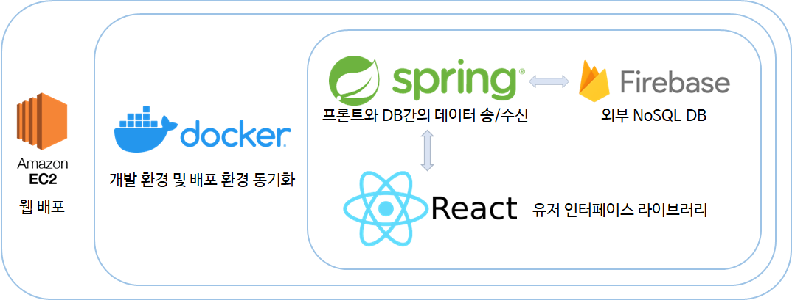

## 팀명
> 치킨밴딧
---
## 제출 세션 및 주제
> 특별 세션 - 주민참여 방법(수단) 부족
---
## 프로젝트 한 줄 설명
> 대구시정에 대해 자유롭게 제언/토론 가능한 플랫폼
---
## 프로젝트 설명
>* 지역 커뮤니티는 몇 존재하지만 정책적인 제언을 하기에는 어려움이 있습니다.
>* 청와대 국민청원에서 영감을 얻어 ‘대구의 일상을 이롭게’ 라는 취지로 ‘대일리(Daeily)’라는 이름을 정하였습니다.
>* 대구시에서 분류한 10가지 분야에 대해 요구, 제언을 업로드하고 다른 사람의 글에 좋아요/싫어요, 댓글로 의견을 표현 할 수 있습니다.
---
## 프로젝트에 활용한 기술

> 1. 유저가 사이트에 접속시 보게 될 인터페이스는 React를 이용하여 구현하였습니다.
> 2. Spring에서는 React로부터 요청받은 데이터를 Firebase의 NoSQL DB서비스 Firestore에 요청합니다. 유저가 임의로 DB를 변조 및 악용하지 못하도록 모든 DB에 대한 요청은 Spring을 통하여 진행하도록 구현하였습니다.
> 3. Firebase의 Firestore를 활용하여 트랜잭션없이 실시간으로 DB가 갱신되고 최신의 정보를 제공할 수 있게 구현하였습니다.
---
## 시연영상

---
>**Note**
> Firebase SDK 키 파일이 Spring 실행파일과 함께 있어야 정상적으로 DB와 통신가능한 서비스입니다.
